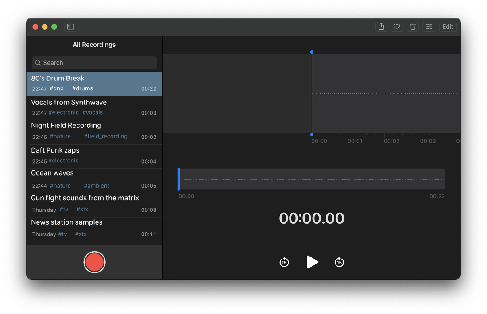
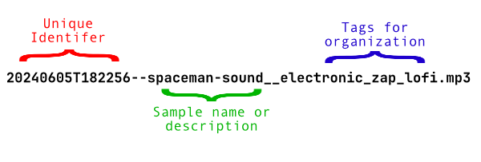

# Replica Proposal

Replica is a lightweight audio sampling tool for macOS. It uses the ScreenCaptureKit introduced in macOS 12 Monterey.

Quickly record audio samples from any application, organize them with tags, and search them from anywhere

## Power of Persuasion

Proposed feature overview:

* Use SwiftUI for a native and fast UI, similar to Voice Memos.app

* Clever file naming scheme - the tags are a part of the filename, making audio samples searchable from any DAW

[replica_filename_demo.webm](https://github.com/marceloexc/replica/assets/35786323/15420d9e-4e9a-4e76-a085-eb8186673db8)

* Use ScreenCaptureKit for inbuilt support of recording system audio in a variety of formats - [no more messing around with Soundflower](https://github.com/mattingalls/Soundflower)

## Considerations

Google tells me the max character limit for file names on macOS (APFS) is 255 characters...so we can't go over that. Wasn't able to find max limits for Windows (NTFS) or Linux (ext4)

## Related reading
 
* [QuickRecorder](https://github.com/lihaoyun6/QuickRecorder)
* [File over app](https://stephango.com/file-over-app)
* [SwiftLAME](https://github.com/hidden-spectrum/SwiftLAME?tab=readme-ov-file)
* [denote](https://github.com/protesilaos/denote) (inspiration for file naming scheme)
* [linkding](https://github.com/sissbruecker/linkding) (inspiration for tagging system)
